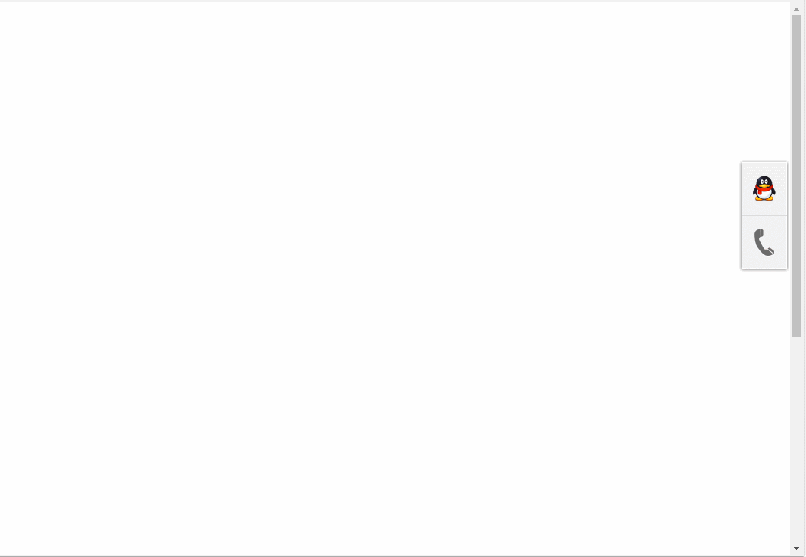

# jQuery带在线客服的右侧悬浮返回顶部代码scrollTop
效果如下：


all code:
```
<!doctype html>
<html lang="en">
<head>
	<meta charset="UTF-8">
	<title>jQuery带在线客服的右侧悬浮返回顶部代码</title>
	<style>
		*{margin:0;padding:0;list-style:none;}
		body{font-family:'MicroSoft Yahei'}
		#rightButton{ position:fixed; _position:absolute; top:208px; right:0; z-index:999999; display:block;}
		#right_ul{ position:relative;}
		#right_qq{  background:url(images/7_03.png) no-repeat; width:68px; height:74px; }
		#right_tel{ background:url(images/7_05.png) no-repeat; width:68px; height:77px; }
		#right_tip{  background:url(images/flag_right.png) no-repeat; width:252px; height:91px; position:absolute; right:70px; top:-10px; display:none; z-index:999999; }
		.flagShow_p1{ float:left; margin-left:15px; _margin-left:5px; font-size:18px; line-height:91px;}
		.flagShow_p2{ float:left; margin-left:10px; _margin-left:5px; font-size:18px;  color:#FA7C00;}
		.flagShow_p2 a{ display:block; margin: 20px 0 5px 12px; line-height:0;}
		.flagShow_p2 span{ margin: 0 0 0 14px; }
		.flag_qq{ display:none;}
		#backToTop{z-index:999999; display:none;}
		a.backToTop_a{  background:url(images/7_08.png) no-repeat; width:68px; height:79px; display:block; }
		a.backToTop_a:active{  background:url(images/7_11.png) no-repeat; }
		.line91{ line-height:91px; }
	</style>
</head>
<body>
<div style="height:1200px;">
	<!--右侧图标-->
	<div id="rightButton">
		<ul id="right_ul">
			<li id="right_qq" class="right_ico" show="qq" hide="tel"></li>
			<li id="right_tel" class="right_ico" show="tel" hide="qq"></li>
			<li id="right_tip" class="png">
				<p class="flagShow_p1 flag_tel">咨询电话</p>
				<p class="flagShow_p2 flag_tel line91">400-800-8000</p>
				<p class="flagShow_p1 flag_qq">咨询QQ</p>
				<p class="flagShow_p2 flag_qq">
					<a href="http://wpa.qq.com/msgrd?v=3&uin=511948469&site=qq&menu=yes" target="_blank">
						
					</a>
					<span>511948469</span>
				</p>
			</li>
			<li>
				<div id="backToTop">
					<a href="javascript:;" onfocus="this.blur();" class="backToTop_a png"></a>
				</div>
			</li>
		</ul>
	</div>
</div>
</body>
</html>
<script src="js/jquery-1.7.1.min.js"></script>
<script>
	$("#rightButton").css("right", "0px");
	var button_toggle = true;
	$(".right_ico").live("mouseover", function(){
		var tip_top;
		var show= $(this).attr('show');
		var hide= $(this).attr('hide');
		tip_top = show == 'tel' ?  65 :  -10;
		button_toggle = false;
		$("#right_tip").css("top" , tip_top).show().find(".flag_"+show).show();
		$(".flag_"+hide).hide();

	}).live("mouseout", function(){
		button_toggle = true;
		hideRightTip();
	});


	$("#right_tip").live("mouseover", function(){
		button_toggle = false;
		$(this).show();
	}).live("mouseout", function(){
		button_toggle = true;
		hideRightTip();
	});

	function hideRightTip(){
		setTimeout(function(){
			if( button_toggle ) $("#right_tip").hide();
		}, 500);
	}

	$("#backToTop").live("click", function(){
		var _this = $(this);
		$('html,body').animate({ scrollTop: 0 }, 500 ,function(){
			_this.hide();
		});
	});

	$(window).scroll(function(){
		var htmlTop = $(document).scrollTop();
		if( htmlTop > 0){
			$("#backToTop").fadeIn();
		}else{
			$("#backToTop").fadeOut();
		}
	});
</script>
```

